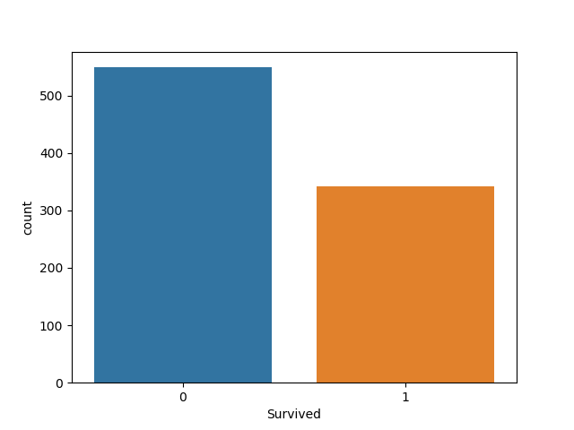
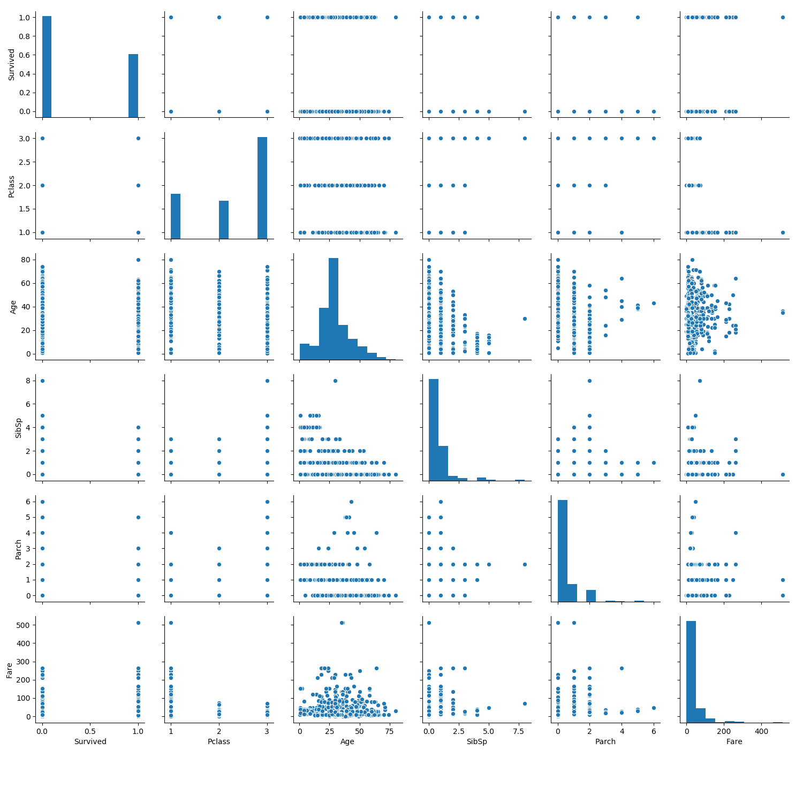
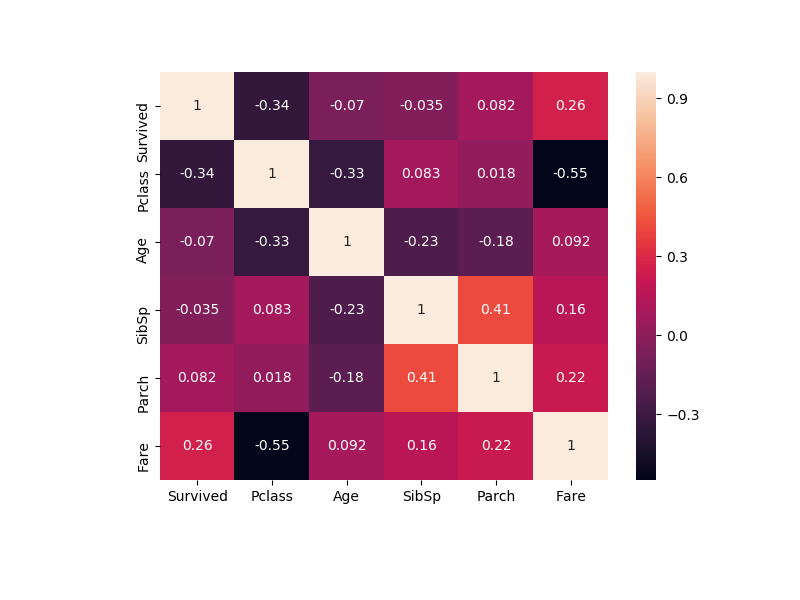
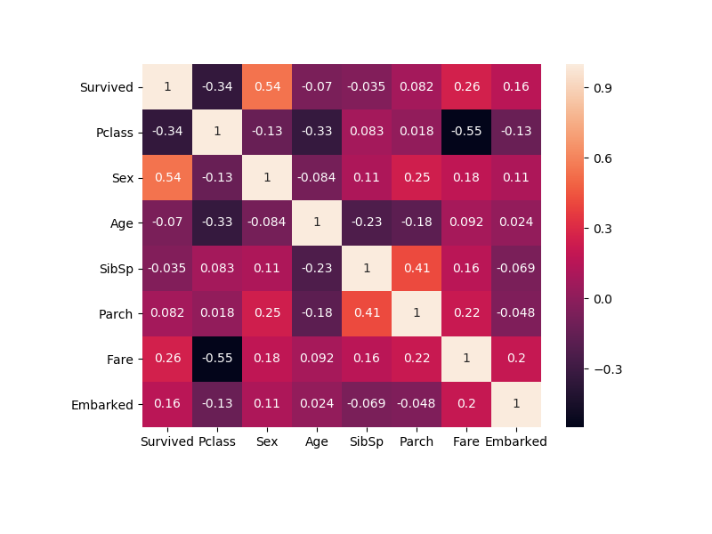
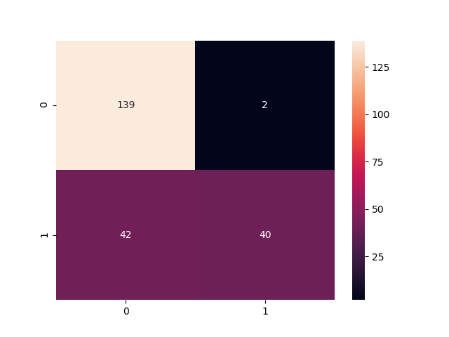
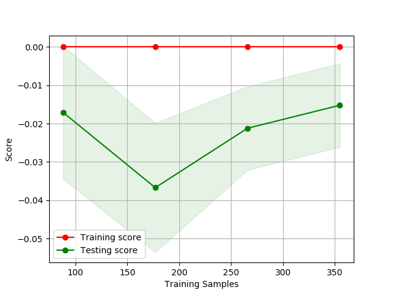

# Machine_Learning-Predicting-titanic-passenger-survival-

•	In this machine learning project, I started with a .csv file with some information upon the titanic passengers.

•	Performed Exploratory data analysis, feature engineering, imputation, data splitting, pca, feature selection, scaling, model validation, etc.

•	I added great commenting detail of every step of the code in the “Research_Project.py” file.

Here I am checking for any class imbalance. We have a class imbalance of about 200 difference which could make our model a bit bias.

Here I am looking for signs of relationships with data, specifically with the survived column.

No relationship noticed at all with Survived and the available plottable columns of data using this pair plot.

Let’s take a closer look with a correlation matrix on a heat map.

Here I am using a heatmap to check for correlation with Survived.

Interesting but it makes sense, I noticed that depending on the type of ticket class the people obtain, correlated with the survival column. I wonder if the higher class had a slightly higher survival rate, and I say that because the price of the fare also played a role in the survival column. This doesn't necessarily mean that higher class tickets holders had a slightly higher survival rate, it just means that it correlated slightly with whether they lived or not.

Confusion matrix to see the performance of the model.

Here I am checking for collinearity. We show no strong correlation between the input features.

Checking learning curve.
